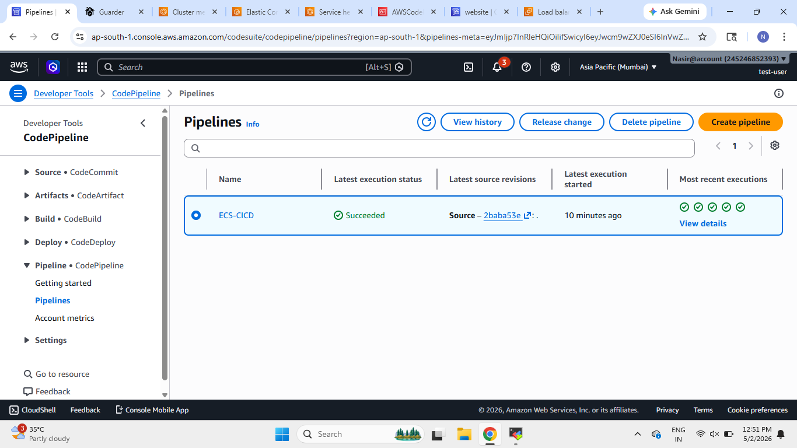
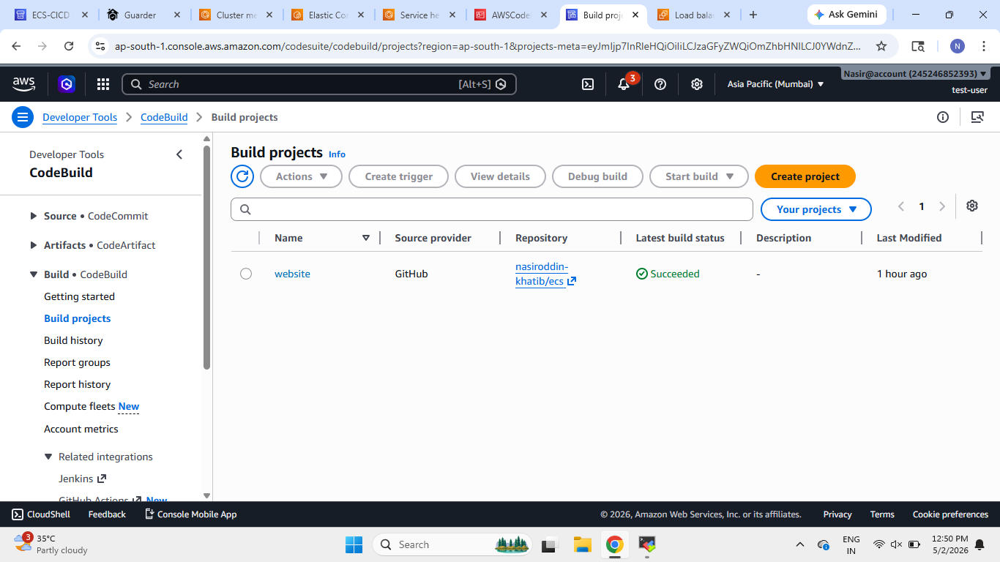
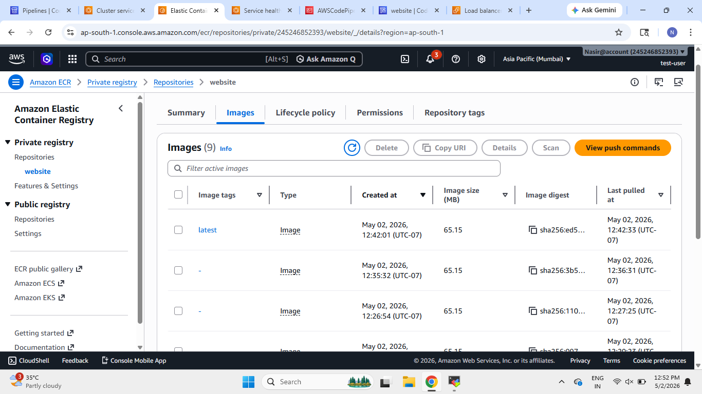
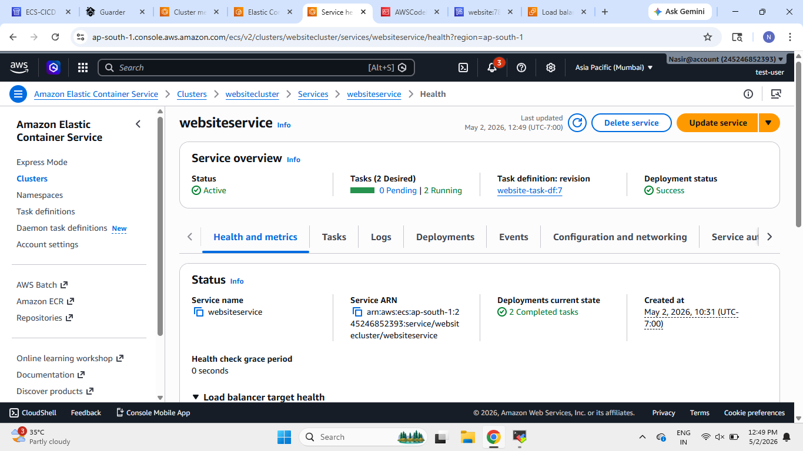
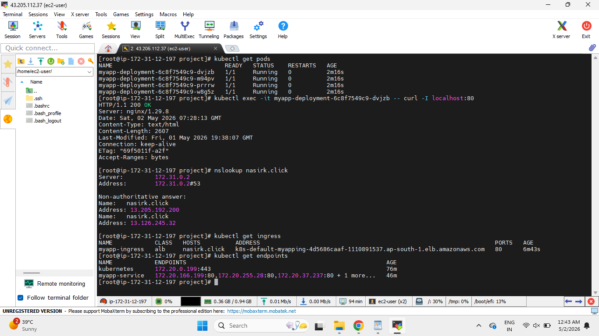
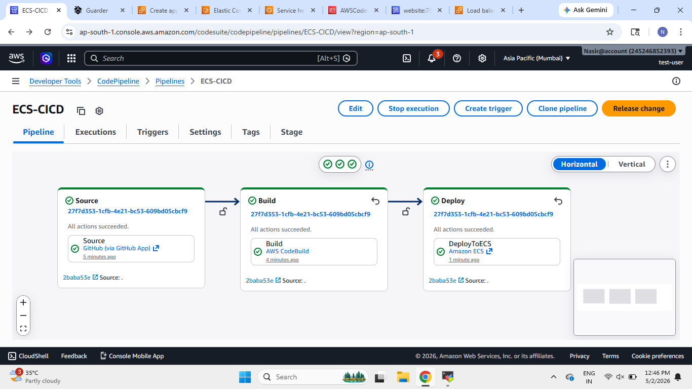
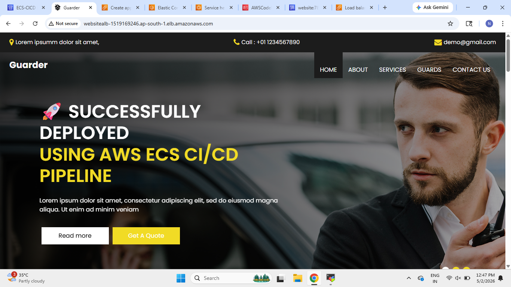

# 🚀 AWS ECS CI/CD Pipeline Deployment

This project demonstrates deployment of a Dockerized static website on AWS ECS using a complete CI/CD pipeline with AWS Developer Tools.

The application is automatically built, pushed to Amazon ECR, and deployed to Amazon ECS whenever changes are pushed to GitHub.

---

# 📌 AWS Services Used

- Amazon ECS
- Amazon ECR
- AWS CodePipeline
- AWS CodeBuild
- Application Load Balancer
- Docker
- GitHub
- NGINX

---

# 🏗️ Project Architecture

```text
GitHub Repository
        ↓
AWS CodePipeline
        ↓
AWS CodeBuild
        ↓
Docker Image Build
        ↓
Amazon ECR
        ↓
Amazon ECS Service
        ↓
Application Load Balancer
        ↓
Website Access
```


---

# ⚙️ CI/CD Workflow

## 1️⃣ Push Code to GitHub

Developer pushes updated code to GitHub repository.

---

## 2️⃣ AWS CodePipeline Triggered

CodePipeline automatically detects repository changes.

---

## 3️⃣ AWS CodeBuild Starts

CodeBuild:

- Builds Docker image
- Tags image
- Pushes image to Amazon ECR

---

## 4️⃣ Amazon ECR Stores Image

Docker image is stored successfully in ECR repository.

---

## 5️⃣ ECS Service Deployment

Amazon ECS service pulls latest image from ECR and deploys updated containers.

---

## 6️⃣ Website Available

Application becomes publicly accessible through the Application Load Balancer.

---

# 📸 Screenshots

# ✅ CodePipeline



---

# ✅ Build Project



---

# ✅ Amazon ECR Image



---

# ✅ ECS Service



---

# ✅ Kubernetes Pods Verification



---

# ✅ Pipeline Success



---

# ✅ Application Successfully Deployed



---

# 🎯 Features

✅ Dockerized Static Website  
✅ Automated CI/CD Pipeline  
✅ GitHub Integration  
✅ Docker Image Build Automation  
✅ Amazon ECR Integration  
✅ ECS Automated Deployment  
✅ Load Balancer Integration  
✅ Public Website Access  
✅ Scalable Container Deployment  

---

# 👨‍💻 Author

## Nasiroddin Khatib

GitHub: https://github.com/nasiroddin-khatib

LinkedIn: https://www.linkedin.com/in/nasiroddin-khatib-269841278/

---

# ⭐ Conclusion

This project demonstrates a complete AWS ECS CI/CD deployment workflow using AWS Developer Tools.

The pipeline automatically:

- Builds Docker image
- Pushes image to Amazon ECR
- Deploys updated containers to ECS
- Makes application publicly accessible

This setup helps achieve automated, scalable, and production-ready container deployment on AWS ECS.
